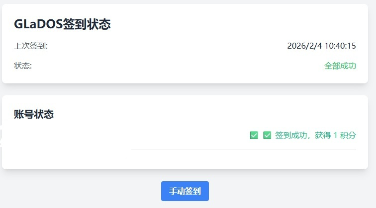

# GLaDOS 自动签到
基于 Cloudflare Workers 的 GLaDOS 自动签到：支持多账号、网页查看状态、手动触发与定时任务；可选 Telegram 通知推送。



- 控制台签到页：https://glados.cloud/console/checkin
- 项目/注册地址参考（实时更新）：https://github.com/glados-network/GLaDOS

## 功能
- 定时自动签到（Cron）
- 网页查看上次签到与账号状态
- 手动签到（打开 Worker 页面点击“手动签到”）
- 多账号（`GLADOS_COOKIE` 使用 `&` 分隔）
- Telegram 通知（可选）
- 积分兑换延长时长（可选）

## 邀请注册（可选）
1. 直接注册 GLaDOS（注册地址在 https://github.com/glados-network/GLaDOS 实时更新）

成功后输入邀请码: ZM2WO-IQVG8-S935S-PE0H6 激活  

2. 通过 https://glados.space/landing/ZM2WO-IQVG8-S935S-PE0H6 注册, 自动填写激活

3. 通过 https://zm2wo-iqvg8-s935s-pe0h6.glados.space , 自动填写激活


## 部署步骤

### GitHub 自动构建/部署（Cloudflare 连接 GitHub）
如果你在 Cloudflare 里配置了“连接 GitHub 自动部署”，并且 Deploy command 使用 `npx wrangler deploy`，
仓库根目录需要提供 Wrangler 配置（例如 `wrangler.toml`）来告诉 Wrangler 入口文件（本项目为 `worker.js`）。

### 1. 创建 Worker
登录 [Cloudflare Dashboard](https://dash.cloudflare.com/)，创建一个新的 Worker，并将 `worker.js` 内容粘贴到脚本编辑器中。

### 2. 创建 KV 命名空间并绑定
```
# 在 Workers & Pages -> KV 中创建命名空间
GLADOS_KV
```

### 3. 配置环境变量
在 Worker 的 Settings -> Variables 中添加变量（建议敏感信息使用 Secret）：

```
GLADOS_COOKIE=你的GLaDOS Cookie

GLADOS_CHECKIN_TOKEN=glados.cloud  # 可选；不填则默认优先使用 glados.cloud

TELEGRAM_BOT_TOKEN=你的Telegram Bot Token

TELEGRAM_CHAT_ID=你的Telegram 用户ID

# 积分兑换（可选；不填则不兑换）
# 兑换档位：100 / 200 / 500
# - 100：100积分 -> 10天
# - 200：200积分 -> 30天
# - 500：500积分 -> 100天
GLADOS_EXCHANGE_PLAN=500

# 兑换冷却时间（小时）。默认 240（10天）；设置为 0 表示每次签到都允许尝试（不建议）
GLADOS_EXCHANGE_COOLDOWN_HOURS=240

# 兑换接口路径候选（逗号分隔）。默认：/api/user/exchange
# 若后续官方接口变动，可在这里覆盖
GLADOS_EXCHANGE_ENDPOINTS=/api/user/exchange

# 是否在兑换后拉取 /api/user/status 做“扣积分/加天数”验证。默认 true
GLADOS_EXCHANGE_VERIFY=true
```

注意：
如果有多个账号，使用 `&` 分隔多个 Cookie，例如：`cookie1&cookie2&cookie3`

Cookie 请自行抓包获取，格式示例：
`koa:sess=...; koa:sess.sig=...`

#### 如何获取 GLaDOS Cookie
这两种方法最终目的都是拿到 `Cookie` 请求头；区别在于复制位置不同。

**方法一：从 Cookies 面板取值并手动拼接（推荐）**
1. 打开浏览器登录 `https://glados.cloud`
2. 按 `F12` 打开开发者工具
3. Chrome：`Application` → `Cookies`；Firefox：`存储(Storage)` → `Cookies`
4. 选择 `glados.cloud`，找到并复制 `koa:sess` 与 `koa:sess.sig` 两个条目的值
5. 按下面格式拼接为一行（注意分号与空格）：`koa:sess=...; koa:sess.sig=...`

**方法二：Network 直接复制请求头（最省事）**
1. 打开签到页：`https://glados.cloud/console/checkin`
2. `F12` → `Network/网络`，刷新页面（`Ctrl + R`）
3. 点开任意一个发往 `glados.cloud` 的请求（例如 `api/user/status` / `api/user/checkin`）
4. 在 `Request Headers/请求标头` 中找到 `Cookie`，复制其完整一整段

将复制到的内容填入 Worker 环境变量 `GLADOS_COOKIE`；多账号用 `&` 连接：`cookie1&cookie2`  
注意：不要换行；不要把多个账号的 Cookie 用逗号分隔。


### 4. 在 Worker 的 Triggers 中添加 Cron 触发器：
```
30 1 * * *    # UTC 1:30 (北京时间 9:30)
```
